# Architecture

The Model-View-Controller (MVC) framework is an architectural/design pattern that separates an application into three main logical components Model, View, and Controller. Each architectural component is built to handle specific development aspects of an application.



Three most important parts were implemented in **Core** folder.

## Model

```php
abstract class Model
{
    public const RULE_REQUIRED = 'required';
    public const RULE_EMAIL = 'email';
    public const RULE_MIN = 'min';
    public const RULE_MAX = 'max';
    public const RULE_MATCH = 'match';
    public const RULE_UNIQUE = 'unique';
    public const RULE_NUMBER = 'number';
    public const RULE_INVALID_EMAIL = 'invalid email';
    public const RULE_WRONG_PASSWORD = 'wrong password';
    public const RULE_INVALID_ID = 'invalid id';
    public const RULE_MIN_VALUE = 'minint';
    public const RULE_MAX_VALUE = 'maxint';
}
```

Class **Model** is an abstract class which serves as an abstract base class for implementing models in this project. The class defines several rules for data validation and contains functions for loading and validating data, storing errors, and customizing error messages. It also has several constants for the different validation rules, such as `RULE_REQUIRED`, `RULE_EMAIL`, `RULE_MIN`, etc.

```php
    abstract public function rules(): array;
```

This abstract method use for listing rules for implementing models. We will use these above rule of abstract class `Model` to define and setup for attributes. Example in user model:

```php
    public function rules(): array
    {
        return [
            'firstname' => [self::RULE_REQUIRED],
            'lastname' => [self::RULE_REQUIRED],
            'email' => [self::RULE_REQUIRED, self::RULE_EMAIL, [
                self::RULE_UNIQUE, 'class' => self::class
            ]],
            'password' => [self::RULE_REQUIRED, [self::RULE_MIN, 'min' => 8]],
            'passwordConfirm' => [[self::RULE_MATCH, 'match' => 'password']],
        ];
    }
```

It returns an array of validation rules for the class. The validation rules are applied to the following fields: firstname, lastname, email, password, and passwordConfirm. The firstname and lastname fields are required, while the email field must be a required, valid email address and must also be unique within the class. The password field must be required and at least 8 characters long. The passwordConfirm field must match the value of the password field.

Another important method to validate and load data from child model instance:

```php
    public function getLabel($attribute);
    public function loadData($data);
    public function validate();
```

## Controller

```php
class Controller 
{
    public string $layout = 'main';
    public string $action = '';
    public BaseMiddleware $middleware;
}
```

The class defines basic properties and methods that are common to all controllers:
- The `$layout` property is a string that specifies the name of the layout that should be used for rendering views.
- The `$action` property is a string that specifies the current action that is being executed.
- The `$middleware` property is an instance of BaseMiddleware class that is used for registering middleware for the controller.

Another importants method of class Controller

```php
    public function setLayout($layout);
    public function render($view, $params = []);
    public function registerMiddleware(BaseMiddleware $middleware);
```

In method render, `$view` is relative path of view and `$params` contains list of parameters that we want to use in view. Example we use `render` method to render user management page:

```php
    public function index() 
    {
        $users = User::getAllUsers();
        $this->setLayout('admin');
        return $this->render('/admin/users/users', [
            'users' => $users
        ]);
    }
```

The index method of the Controller retrieves all users from the User model using the getAllUsers method. Then, it sets the layout of the page to `admin` and returns a rendered view of the `admin/users/users` template with an array of users passed as a parameter. The array of users will be available in the view and can be used to display the list of users.

## View

```php
class View
{
    public function renderView($view, array $params)
    {
        $layoutName = Application::$app->layout;
        if (Application::$app->controller) {
            $layoutName = Application::$app->controller->layout;
        }
        $viewContent = $this->renderViewOnly($view, $params);
        ob_start();
        include_once Application::$ROOT_DIR . "/views/layouts/$layoutName.php";
        $layoutContent = ob_get_clean();
        return str_replace('{{content}}', $viewContent, $layoutContent);
    }
}
```

The method renderView of the Router class takes a view path and an array of parameters as input and returns a complete HTML page by rendering the view and embedding it in the layout specified by the application or the current controller.

It starts by setting a variable $layoutName to the value of the layout property of the application, but if there's a Controller instance stored in the controller property of the application, it overrides $layoutName with the value of the layout property of that instance.

Summary, we used all native and popular method of PHP to build interface of MVC architect.