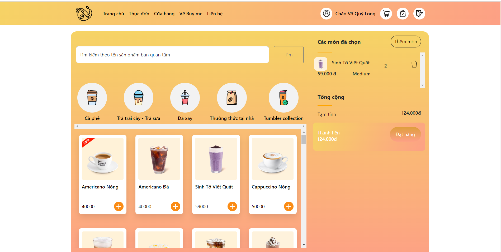

<p align="center">
  <a href="https://buymee.herokuapp.com">
    
    <h2 align="center">POINT OF SALE</h2>
    <h3 align="center">Pure PHP MVC</h3>
  </a>
</p> 
<p align="center">Finally a POS system that integrates with your marketing, sales, inventory and eCommerce. A simple and flexible POS you can configure to meet your retail shop's precise needs.</p>

[](https://travis-ci.org/anuraghazra/anuraghazra.github.io)





*NOTE: If you are using this site as a template for your own portfolio site, I would be very glad if you add a link to the original site with my name in footer*

## :rocket: Quick start

**Run the site locally**

_NOTE: The default branch for this repo is `master`, when you push or pull make sure you specify the correct branch_

### Step 1: Clone The Repo

Fork the repository. then clone the repo locally by doing -

```bash
git clone https://github.com/Blue-Pheasant/Point-of-sale
```

### Step 2: Install Dependencies

Access into the project directory

```bash
cd Point-of-sale
```

Install all the dependencies
```bash
composer install
```

### Step 3: Setup enviroment variables
There is an example of enviroment variables

```bash
DB_DSN=mysql:host=localhost;dbname=buymee
DB_USER=root
DB_PASSWORD=
```

### Step 4:
Migrate database

```bash
php migrations.php
```

Terminal returns the following, you have already run migrate successfully:

```bash
[2021-10-28 19:10:49] - Applying migration m0001_initial.php
[2021-10-28 19:10:49] - Applyied migration m0001_initial.php
```

### Step 5: Start Development Server

Access public folder
```
cd public
```

Then start the development Server
```
php -S localhost:8000
```
After running the development server the site should be running on https://localhost:8000


## :open_file_folder: What's inside?

A quick look at the folder structure of this project.

    .
    ├───config
    │
    ├───Controllers
    │       AdminController.php
    │       CartController.php
    │       CategoryController.php
    │       FeedbackController.php
    │       MenuController.php
    │       OrderDetailController.php
    │       OrdersController.php
    │       ProductController.php
    │       ProfileController.php
    │       SiteController.php
    │       StoreController.php
    │       UserController.php
    │
    ├───core
    │   │   Application.php
    │   │   Controller.php
    │   │   Database.php
    │   │   DBModel.php
    │   │   MasterModel.php
    │   │   Model.php
    │   │   Request.php
    │   │   Response.php
    │   │   Router.php
    │   │   Session.php
    │   │   UserModel.php
    │   │   View.php
    │   │   
    │   └───Form
    │           Field.php
    │           Form.php
    │
    ├───exception
    │       forbiddenException.php
    │       ForLoginException.php
    │       NotFoundException.php
    │
    ├───fonts
    │
    ├───middlewares
    │       AdminMiddleWare.php
    │       AuthMiddleWare.php
    │       BaseMiddleWare.php
    │
    ├───migrations
    │       m0001_initial.php
    │       m0002_importData.php
    │
    ├───Models
    │       cart.php
    │       CartDetail.php
    │       CartItem.php
    │       Category.php
    │       Feedback.php
    │       loginform.php
    │       Order.php
    │       OrderDetail.php
    │       OrderItem.php
    │       Product.php
    │       Store.php
    │       User.php
    │
    ├───mysql
    │
    ├───nginx
    │
    ├───php
    │       local.ini
    │
    ├───public
    │   │   .htaccess
    │   │   index.php
    │   │
    │   ├───bootstrap
    │   ├───css
    │   │   └───page
    │   │   └───admin
    │   ├───images
    │   │   ├───home
    │   │   ├───logo
    │   │   ├───payment
    │   │   ├───poster
    │   │   └───slider
    │   └───js
    ├───vendor
    └───views
        ├───page
        ├───admin
        │   │   dashboard.php
        │   │   profile.php
        │   │
        │   ├───categories
        │   │
        │   ├───orders
        │   │
        │   ├───products
        │   │
        │   ├───stores
        │   │
        │   └───users
        │
        └───layouts
                admin.php
                auth.php
                main.php

## Tools Used

1. Docker
2. Github action for CI/CD

## :v: Contributing

*NOTE: if you want to change the [blog content](./content) or fix any typo you can do that from github's ui without cloning the repo locally*

After cloning & setting up the local project you can push the changes to your github fork and make a pull request.

> You can also run the tests locally to see if everything works fine with

### Pushing the changes

```bash
git add .
git commit -m "commit message"
git push YOUR_REPO_URL master
```

------

## :books: Documentation
If you want in-depth knowledge about this project, then we have written them under the in-depth documents, with all the love, spread of the Ho Chi Minh university of Technology students in this project. [Read more](docs/README.md)

Made with my :heart: and youthful enthusiasm
